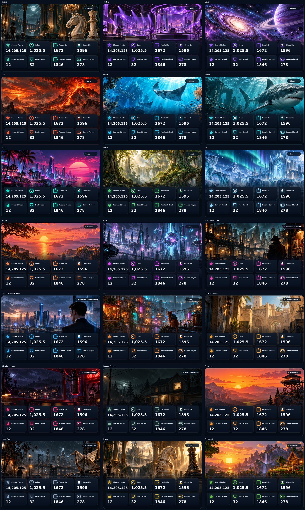
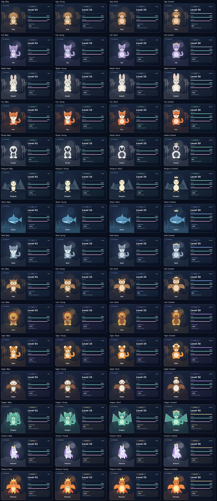

# Profile and Pet showcases

The default profile design uses a full cinematic illustration for each of the 21 themes. Only the theme badge remains above the eight-stat dashboard: no brand header, slogans, repeated name or Discord avatar. Stat icons are 62 px instead of 24 px; labels and values remain clear against dark panels. Profile images use compact JPEG attachments with theme/content-specific names, and immutable render bytes are cached. No background is downloaded while a Discord interaction is running.

Pets use original SVG illustrations in `assets/pets/`. Each species file contains `Baby`, `Young`, `Adult`, and `Evolved` groups in a 400 × 350 canvas. `catalog.json` defines the asset, colors and habitat. Replace these files to improve the artwork without changing care, economy, progression or persistence. The renderer is in `showcase_cards.py`. Unhatched eggs never select species artwork or disclose rarity.

`!profile [name or @user]`, `!pet [name or @user]`, and `!pets [name or @user]` support public browsing. `/profile`, `/pet`, and `/pets` expose optional Discord `user` selectors. The profile's **View Pets** button and collection selector retain the viewed user's identity. Other players' pets have only read-only collection and memorial controls.

## Restoring previous designs

The complete v1.1.6 profile renderer and all its original theme scenes remain in `bot.make_profile_card_file_legacy`. The previous pet portrait remains in `pet_ui.pet_image_legacy`. Set `SHARKBOT_CARD_STYLE=legacy` in the bot process environment and restart to select both old renderers, or change the default in `showcase_cards.legacy_style` for a code-based rollback. This does not revert public browsing or any player data. The original baseline is commit `78b3e90c6d64f62db50a3e23348eb7f94bad164c`.

The immediately preceding showcase layout remains in `showcase_cards.profile_svg_v1`. Set `SHARKBOT_PROFILE_CARD_STYLE=showcase-v1` to restore that profile design while retaining the current pet cards. Its reference gallery is saved as [profiles-v1.jpg](previews/profiles-v1.jpg).

Shop interactions acknowledge immediately before doing I/O. Preview requests capture their selected theme and page; obsolete renders are discarded, and message edits are serialized so only the newest selection remains visible. The preview embed references the exact uploaded filename.

Validation is offline: rendering every theme and every pet evolution, hidden egg identity, public navigation and ownership checks, all existing bot/persistence tests, and the minigame suite. Discord and Twitch credentials are not needed.

## Preview galleries

These are generated using sample stats, not live player data.

